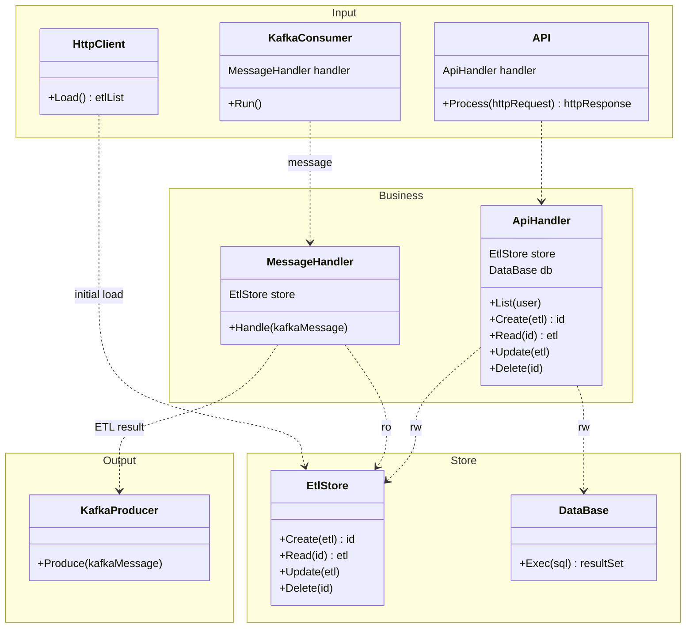
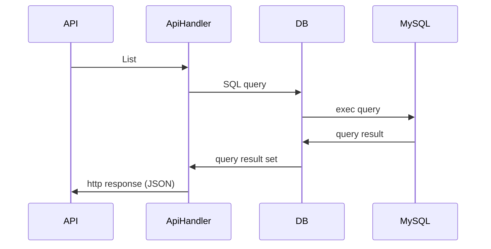

```mermaid
classDiagram
    namespace Input {
        class KafkaConsumer {
            MessageHandler handler
            +Run()
        }
        class HttpClient {
            +Load() etlList
        }
        class API {
            ApiHandler handler
            +Process(httpRequest) httpResponse
        }
    }
    namespace Output {
        class KafkaProducer {
            +Produce(kafkaMessage)
        }
    }
    namespace Store {
        class EtlStore {
            +Create(etl) id
            +Read(id) etl
            +Update(etl)
            +Delete(id)
        }
        class DataBase {
            +Exec(sql) resultSet
        }
    }
    namespace Business {
        class MessageHandler {
            EtlStore store
            +Handle(kafkaMessage)
        }
        class ApiHandler {
            EtlStore store
            DataBase db
            +List(user)
            +Create(etl) id
            +Read(id) etl
            +Update(etl)
            +Delete(id)
        }
    }
    HttpClient ..> EtlStore: initial load
    KafkaConsumer ..> MessageHandler: message
    MessageHandler ..> EtlStore: ro
    MessageHandler ..> KafkaProducer: ETL result

    API ..> ApiHandler
    ApiHandler ..> DataBase: rw
    ApiHandler ..> EtlStore :rw
```

```mermaid
sequenceDiagram
  API->>ApiHandler: List
  ApiHandler->>DB: SQL query
  DB->>MySQL: exec query
  MySQL->>DB: query result
  DB->>ApiHandler: query result set
  ApiHandler->>API: http response (JSON)
```
